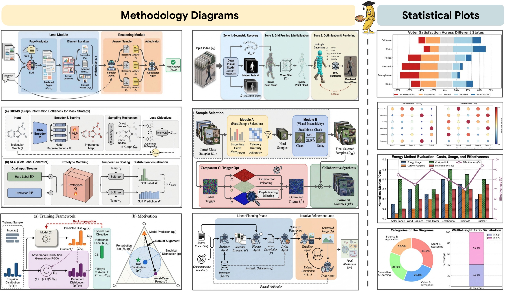
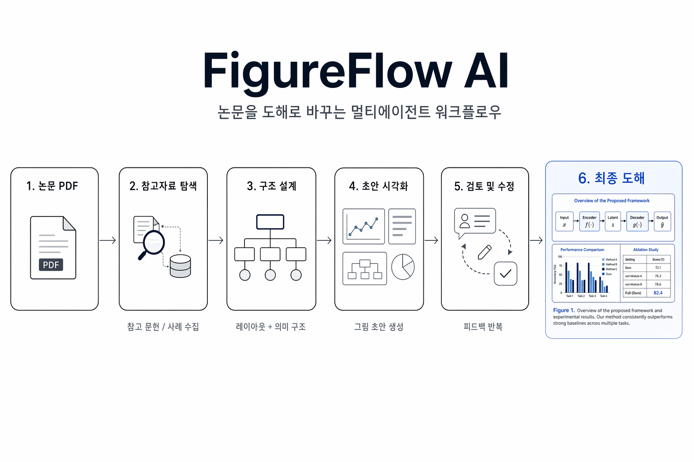

# <div align="center">PaperVizAgent · FigureFlow AI</div>

<div align="center">
논문 내용을 발표 가능한 도식으로 바꾸는 멀티에이전트 시각화 워크플로우
<br><br>

<a href="https://arxiv.org/pdf/2601.23265"></a>
<a href="https://dwzhu-pku.github.io/PaperBanana/"></a>
<a href="https://huggingface.co/papers/2601.23265"></a>
<a href="https://huggingface.co/datasets/dwzhu/PaperBananaBench"></a>
<a href="https://github.com/dwzhu-pku/PaperBanana"></a>
<br><br>
</div>

> 이 저장소는 **PaperBanana / PaperVizAgent**를 기반으로, OpenAI 이미지 백엔드와 실제 데모 흐름까지 정리한 **한국어 중심 포크**입니다.
>
> 이 포크에서는 서비스형 이름으로 **FigureFlow AI**라는 브랜딩 톤을 함께 사용합니다. 저장소 이름은 `papervizagent`를 유지하지만, 문서와 샘플은 더 직관적이고 제품적인 방향으로 정리했습니다.

---

## 한눈에 보기

**PaperVizAgent**는 논문 내용을 읽고,
참고 사례를 찾고,
구조를 설계하고,
그림 초안을 만들고,
검토·수정까지 반복해
최종적으로 **논문/발표용 도식**을 생성하는 멀티에이전트 프레임워크입니다.

이 포크의 핵심 차별점은 다음입니다.

- **OpenAI GPT Image 기반 생성/수정 워크플로우 지원**
- **Streamlit refine/edit 경로까지 OpenAI 연동 완료**
- **Google ADC가 없어도 OpenAI-only 로컬 실행 가능**
- **한국어 README 및 데모 문서화**

---

## 결과 예시

### 생성 예시


### FigureFlow AI 한글 샘플
> 이 포크에서 실제 OpenAI 이미지 백엔드로 생성한 한글 시스템 다이어그램 샘플입니다.



### 전체 구조


---

## 이 프로젝트가 하는 일

PaperVizAgent는 아래 5개 에이전트를 조합해 논문 도식을 만듭니다.

1. **Retriever Agent**  
   관련 참고 그림, 유사 사례, 스타일 힌트를 탐색합니다.

2. **Planner Agent**  
   논문 내용과 전달 의도를 바탕으로 도식 구조를 텍스트 계획으로 바꿉니다.

3. **Stylist Agent**  
   학술 발표/논문 그림에 맞는 시각 스타일로 설명을 다듬습니다.

4. **Visualizer Agent**  
   실제 이미지 생성 모델을 이용해 도식 초안을 만듭니다.

5. **Critic Agent**  
   결과를 검토하고 수정 지시를 만들어 반복 개선합니다.

즉, 단순 이미지 생성기가 아니라,
**논문 → 구조화 → 시각화 → 반복 수정** 흐름을 가진 도식 제작 파이프라인입니다.

---

## 이 포크에서 달라진 점

원본은 PaperBanana / PaperVizAgent 구조를 유지하지만,
이 포크는 실제 사용성을 높이는 방향으로 정리했습니다.

### OpenAI 중심 워크플로우 추가
- `gpt-image-2-2026-04-21` 기준으로 이미지 생성 테스트 완료
- `gpt-image-2` 별칭도 사용 가능
- 기존 Gemini 중심 흐름 외에 **OpenAI 기반 refine/edit 경로** 지원

### Streamlit refine 탭 확장
- 업로드한 이미지를 바탕으로 수정 요청 가능
- OpenAI `images.edit(...)` 흐름 연결 완료
- 데모에서 바로 결과 확인 가능

### OpenAI-only 실행 안정화
- Google ADC / Vertex 자격 증명이 없어도
  **OpenAI만으로 로컬 부팅 시 하드 크래시하지 않도록 보강**했습니다.

### 문서 재정리
- 한국어 Quick Start
- OpenAI 우선 설정 가이드
- 스모크 테스트 체크리스트
- 향후 서비스형 브랜딩(FigureFlow AI) 톤 반영

---

## 빠른 시작

### 1) 저장소 클론
```bash
git clone https://github.com/techkwon/papervizagent.git
cd papervizagent
```

### 2) 가상환경 준비
```bash
uv venv
source .venv/bin/activate
uv python install 3.12
uv pip install -r requirements.txt
```

> 이 프로젝트는 `uv` 기반 사용을 권장합니다.

---

## 설정 방법

이 프로젝트는 환경 변수 또는 `configs/model_config.yaml`로 설정할 수 있습니다.

### 추천: OpenAI 우선 설정

`configs/model_config.template.yaml`을 복사해 로컬 설정 파일을 만듭니다.

```bash
cp configs/model_config.template.yaml configs/model_config.yaml
```

`configs/model_config.yaml` 예시:

```yaml
defaults:
  model_name: "gpt-4.1-mini"
  image_model_name: "gpt-image-2-2026-04-21"

google_cloud:
  project_id: ""
  location: "global"

api_keys:
  google_api_key: ""
  openai_api_key: ""
  anthropic_api_key: ""

anthropic:
  region: "us-central1"
  project_id: ""
```

환경 변수로 OpenAI 키를 넣습니다.

```bash
export OPENAI_API_KEY="***"
```

### 권장 이미지 모델
- 기본 권장: `gpt-image-2-2026-04-21`
- 별칭: `gpt-image-2`
- 대안: `gpt-image-1.5`, `chatgpt-image-latest`

---

## Gemini / Vertex 설정

원본 흐름에 가깝게 쓰고 싶다면 아래 중 하나를 설정하면 됩니다.

- `GOOGLE_API_KEY`
- 또는 Vertex / Google Cloud 자격 증명
  - `GOOGLE_CLOUD_PROJECT`
  - `GOOGLE_CLOUD_LOCATION`

이 포크에서는 **ADC/Vertex가 없어도 OpenAI-only 경로가 죽지 않도록** 보강했지만,
Gemini 경로를 실제로 쓰려면 유효한 Gemini 설정이 필요합니다.

---

## 실행 방법

### Streamlit 데모 실행
가장 쉬운 시작 방법입니다.

```bash
streamlit run demo.py
```

### 데모에서 할 수 있는 것

#### 1. 후보 이미지 생성
- 논문 method 내용을 붙여넣기
- figure caption 입력
- 파이프라인 모드, retrieval 방식, 후보 수, critic round 설정
- 여러 후보 이미지를 병렬 생성
- 결과를 그리드로 보고 개별 다운로드 또는 ZIP 다운로드

#### 2. 이미지 수정 / 고해상도 보정
- 생성된 그림 또는 임의의 도식 이미지 업로드
- 수정 요청 프롬프트 입력
- 2K / 4K 해상도 선택
- OpenAI 또는 Gemini 기반 refine 경로 사용
- 수정 결과 다운로드

---

## OpenAI 스모크 테스트 체크리스트

OpenAI 경로가 제대로 붙었는지 빠르게 확인하려면 아래 순서로 점검하면 됩니다.

```bash
cp configs/model_config.template.yaml configs/model_config.yaml
# defaults.image_model_name 을 gpt-image-2-2026-04-21 로 설정
export OPENAI_API_KEY="***"
streamlit run demo.py
```

확인 포인트:

1. **앱 부팅 성공**  
   import/config 오류 없이 Streamlit이 떠야 합니다.

2. **후보 이미지 생성 성공**  
   OpenAI 이미지 모델로 최소 1개 후보가 생성되어야 합니다.

3. **refine 탭 수정 성공**  
   업로드 이미지에 대해 수정 요청 후 PNG 결과가 반환되어야 합니다.

4. **Gemini fallback 분리 확인**  
   Gemini 모델을 쓸 때는 Gemini 자격 증명이 필요하며,
   없더라도 OpenAI-only 경로 자체는 깨지지 않아야 합니다.

추가 메모는 [`OPENAI_GPT_IMAGE_NOTES.md`](OPENAI_GPT_IMAGE_NOTES.md)에서 볼 수 있습니다.

---

## CLI 실행

데모 UI 말고 커맨드라인으로도 실행할 수 있습니다.

### 기본 실행
```bash
python main.py
```

### 예시 실행
```bash
python main.py \
  --dataset_name "PaperBananaBench" \
  --task_name "diagram" \
  --split_name "test" \
  --exp_mode "dev_full" \
  --retrieval_setting "auto"
```

### 주요 옵션
- `--dataset_name`: 사용할 데이터셋 이름
- `--task_name`: `diagram` 또는 `plot`
- `--split_name`: 데이터셋 split
- `--exp_mode`: 실행 모드
- `--retrieval_setting`: `auto`, `manual`, `random`, `none`

### 주요 실행 모드
- `vanilla`: 계획/비평 없이 바로 생성
- `dev_planner`: Planner → Visualizer
- `dev_planner_stylist`: Planner → Stylist → Visualizer
- `dev_planner_critic`: Planner → Visualizer → Critic
- `dev_full`: 전체 파이프라인
- `demo_planner_critic`: 데모용 Planner → Visualizer → Critic
- `demo_full`: 데모용 전체 파이프라인

---

## 시각화 도구

### 파이프라인 진화 보기
```bash
streamlit run visualize/show_pipeline_evolution.py
```

### 평가 결과 보기
```bash
streamlit run visualize/show_referenced_eval.py
```

---

## 프로젝트 구조

```text
papervizagent/
├── agents/                # Retriever / Planner / Stylist / Visualizer / Critic
├── configs/               # 모델 설정 템플릿
├── data/                  # 데이터셋 위치
├── prompts/               # 프롬프트 모음
├── results/               # 생성 결과
├── scripts/               # 실행 스크립트
├── style_guides/          # 스타일 가이드 생성/관리
├── utils/                 # 설정, 생성, 평가, 이미지 유틸
├── visualize/             # 파이프라인/평가 시각화 UI
├── demo.py                # Streamlit 데모
├── main.py                # CLI 엔트리 포인트
└── README.md
```

---

## 핵심 특징

### 멀티에이전트 파이프라인
- **Reference-Driven**: 참고 사례 기반 생성
- **Iterative Refinement**: Critic-Visualizer 루프 반복 개선
- **Style-Aware**: 학술 도식 스타일 반영
- **Flexible Modes**: 다양한 실험/데모 모드 제공

### 실전 데모 사용성
- **병렬 후보 생성**
- **파이프라인 진화 시각화**
- **2K / 4K 보정 흐름**
- **PNG / ZIP 배치 다운로드**

### 확장성
- 각 에이전트가 모듈형으로 분리됨
- diagram / plot 작업 모두 지원
- 평가 프레임워크 포함
- 비동기 배치 처리 가능

---

## 데이터셋

`PaperBananaBench` 데이터셋은 원본 프로젝트 기준으로 제공됩니다.

- Hugging Face: https://huggingface.co/datasets/dwzhu/PaperBananaBench

데이터셋이 없어도 일부 흐름은 동작하지만,
Retriever Agent의 few-shot 참조 성능은 제한됩니다.

---

## 인용

이 저장소 또는 원 논문이 도움이 되었다면 아래 논문을 인용해 주세요.

```bibtex
@article{zhu2026paperbanana,
  title={PaperBanana: Automating Academic Illustration for AI Scientists},
  author={Zhu, Dawei and Meng, Rui and Song, Yale and Wei, Xiyu and Li, Sujian and Pfister, Tomas and Yoon, Jinsung},
  journal={arXiv preprint arXiv:2601.23265},
  year={2026}
}
```

---

## 주의사항

- 이 프로젝트는 **공식 Google 제품이 아닙니다.**
- 데모 및 연구 실험 목적에 가깝고,
  바로 프로덕션 서비스로 쓰기 위한 상태라고 보기는 어렵습니다.
- OpenAI/Gemini 등 외부 모델 API 품질과 정책 변화에 영향을 받을 수 있습니다.

---

## 업스트림 / 참고 링크

- 원 논문: https://arxiv.org/pdf/2601.23265
- 프로젝트 페이지: https://dwzhu-pku.github.io/PaperBanana/
- 업스트림 저장소: https://github.com/dwzhu-pku/PaperBanana
- 이 포크: https://github.com/techkwon/papervizagent

---

## 한 줄 정리

**FigureFlow AI 톤으로 정리한 이 포크는, PaperVizAgent를 한국어 중심으로 다듬고 OpenAI 이미지 생성 워크플로우까지 실제로 바로 써볼 수 있게 만든 버전입니다.**
